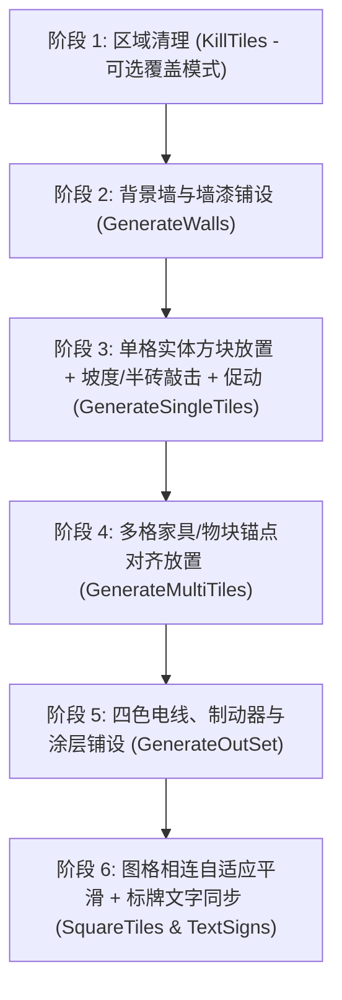
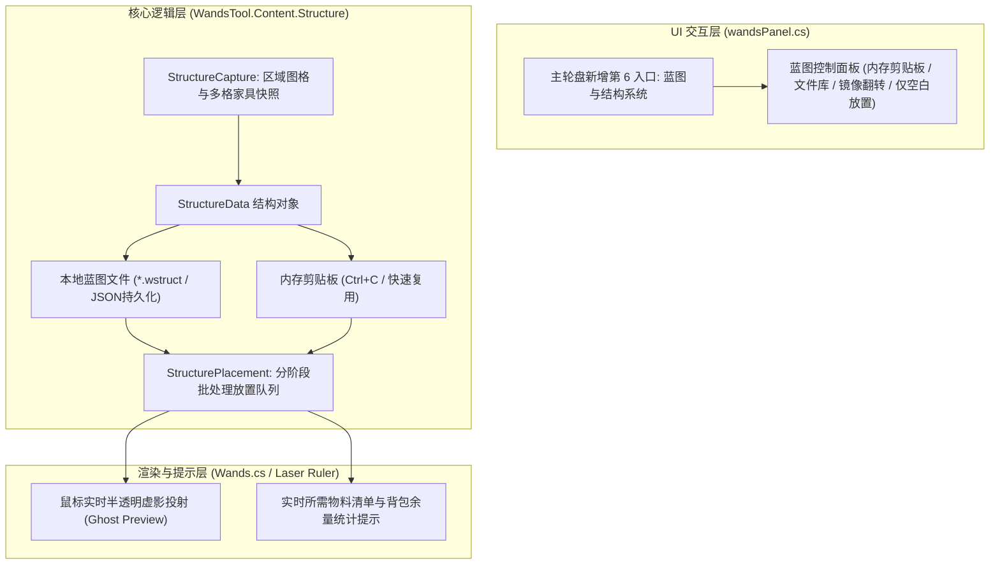

# WandsTool 区域结构复制/保存/蓝图粘贴系统实施设计方案

> **基于 Quality of Terraria (更好的体验 / ImproveGame v1.8.2) 核心源码逆向解构与工程化适配**  
> **Author**: `SaintCirno9`  
> **目标工程**: `tPlainModLoader/Mods/WandsTool`  

---

## 1. Quality of Terraria 核心架构深度解密

在反编译并审查 `ImproveGame` 的 `ConstructWand` 与 `Functions.Construction` 源码后，其工业级建筑蓝图系统的底层实现可归纳为以下四大关键支柱：

### 1.1 数据协议与状态序列化（`TileDefinition` & `QoLStructure`）
* **精简图格模型（`TileDefinition`）**：
  * 将庞大的世界 `Tile` 提炼为只包含有效构建信息的紧凑模型：`TileIndex`（-1 为空气）、`WallIndex`、`TileFrameX/Y`、`WallFrameX/Y`、`TileColor`、`WallColor`、`CoatingData`（涂层）、`BlockType`（坡度/半砖）以及 4 色电线与促动器状态（压缩在 `BitsByte` 中）。
  * **Mod 物块/墙壁跨世界映射**：通过 `FullName + "t"` / `FullName + "w"` 记录 Mod 命名空间全名，反序列化时动态通过 `TryFind` 解析 ID，保证 Mod 增删或 ID 漂移时的结构鲁棒性。
* **结构容器（`QoLStructure`）**：
  * 记录 `Width`、`Height`、`OriginX`、`OriginY`、`BuildTime`、`ModVersion`、`SignTexts`（标牌文字列表）以及 `StructureDatas` 展平数组。

### 1.2 分步防崩塌放置管线（`GenerateCore`）
多格家具（如床、门、桌椅、箱子）如果先于支撑物块或背景墙放置，会触发原版物理检测导致**瞬间崩塌碎成掉落物**。ImproveGame 采用了严格的**六阶段管线**与协程分帧机制（每帧 50~60 图格，避免掉帧）：


### 1.3 多格物块与家具锚点识别（`MultiTile Alignment`）
* 原版多格物块（如 3x2 床、2x3 门）在世界中由多个小格子组成，但放置时只能在特定**锚点（Origin）**调用 `PlaceObject` 或 `TryPlaceMultiTileDirect`。
* 解决方案：利用 `TileObjectData.GetTileData(type, style)` 获取该家具的 `Origin` 偏移与尺寸，仅在遍历到原点坐标时从背包扣除 1 个家具物品并触发放置。

### 1.4 物料搜索与智能扣除（`MaterialCore`）
* 自动统计结构所需的物料清单（物块数量、墙壁数量、家具数量、电线数量）；
* 放置时遍历玩家背包、钱币槽、虚空袋等容器进行安全扣除。

---

## 2. WandsTool 建筑蓝图系统设计方案

将上述经验无缝融入我们现有的 `WandsTool`（极速批处理队列 + 环形轮盘 UI + 无缝动作隔离）：



---

## 3. 核心功能规范与特性

### 3.1 内存剪贴板（Clipboard）+ 本地蓝图库（Blueprint Library）双轨制
1. **内存剪贴板（即时复制粘贴）**：
   - 切换到【结构复制】模式，在世界中左键拖拽选区 -> 瞬间抓取并存入内存剪贴板；
   - 自动无缝切换到【结构粘贴】模式，鼠标随动投射虚影，左键点击即可原地或异地快速粘贴！无需强制起名存文件，极速搭建对称建筑。
2. **本地蓝图库（持久化存储）**：
   - 支持将当前剪贴板一键保存为本地蓝图文件（默认路径：`Terraria/tPlainModLoader/Mods/WandsTool/Blueprints/*.wstruct`）；
   - 支持在 UI 面板中浏览已保存的蓝图列表、一键载入、重命名或删除。

### 3.2 结构镜像翻转（Mirror / Flip）
* 在粘贴模式下，支持快捷键（如 `H` 键水平镜像翻转，`V` 键垂直翻转）；
* 翻转时不仅自动变换图格相对坐标，同时自动反转斜坡朝向（`SlopeUpLeft` $\leftrightarrow$ `SlopeUpRight`）和家具朝向！

### 3.3 放置模式设置
* **覆盖模式（Overwrite）**：自动清除目标区域原有阻挡物，完美复刻蓝图；
* **仅空白放置（Place Only / Non-Destructive）**：遇到已有物块不破坏，仅在空位填充蓝图物块；
* **仅方块 / 仅背景墙 / 包含家具 / 包含电线**：支持分层过滤。

### 3.4 虚影预览与物料清单浮窗（Preview & Material Counter）
* **半透明建筑虚影**：在粘贴状态下，随鼠标位置实时绘制整套建筑的预览效果；
* **物料统计与消耗**：
  * 光标旁或屏幕右侧浮窗展示所需物料列表（如：`木材 x120 [背包: 250] ✅`、`玻璃墙 x80 [背包: 0] ❌`）；
  * 若开启物料消耗，按背包实际拥有物料逐一扣除并放置；若开启 ModConfig 的免消耗模式，则自由无限摆放。

---

## 4. 模块结构与文件划分

```
WandsTool/Content/Structure/
├── TileSnapshot.cs              # 单格图格快照数据定义 (Tile/Wall/Frame/Slope/Wire/Color/Coating)
├── StructureData.cs             # 蓝图结构主数据对象 (宽/高/原点/物料清单统计/镜像翻转逻辑)
├── StructureStorage.cs          # 本地蓝图文件的序列化、反序列化与 IO 管理 (JSON / TagCompound)
├── StructureCapture.cs          # 选区扫描抓取器 (多格家具与实体识别)
├── StructurePlacement.cs        # 六阶段分步安全放置引擎 (对接 WandAction 批处理队列)
├── StructurePreview.cs          # 虚影渲染器与物料消耗浮窗
└── UI/
    ├── UIStructurePanel.cs      # 蓝图管理面板 (文件列表、载入、保存、导出)
    └── UIStructureCard.cs       # 蓝图项目卡片 UI
```

---

## 5. 实施路线规划

1. **第一阶段：数据模型与选区抓取**
   - 编写 `TileSnapshot.cs` 与 `StructureData.cs`，实现包含方块、墙壁、斜坡、电线、多格物块的完整快照与镜像翻转算法；
   - 编写 `StructureStorage.cs` 实现本地蓝图保存与读取。
2. **第二阶段：分阶段安全放置引擎**
   - 编写 `StructurePlacement.cs`，实现严格顺序放置（清理 -> 墙壁 -> 方块/坡度 -> 多格家具 -> 电线 -> Framing），并对接 `WandAction` 的批量更新机制与物料扣除。
3. **第三阶段：虚影投射与物料悬浮提示**
   - 在 `SetupDrawInterfaceLayersPostfix` 中挂载预览层，绘制半透明虚影与所需物料统计。
4. **第四阶段：UI 轮盘与管理界面集成**
   - 在 `wandsPanel` 与快捷键体系中加入结构复制/粘贴模式与蓝图管理器。
